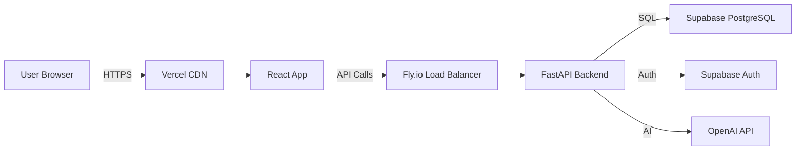

# Session 5 — Production Deployment & CI/CD (ENHANCED)

# Status: Draft - Enhanced

# Last updated: 2024-12-30

## What This Session Is About

Session 5 transitions the demo course app from local development to production
by deploying the frontend to **Vercel** and the backend to **Fly.io** with
automated **CI/CD pipelines** via GitHub Actions. Learners will implement a
complete deployment workflow that includes quality gates (CI checks), automated
deployments (CD), environment configuration, and operational best practices.

The session balances **practical deployment skills** (creating accounts,
configuring platforms) with **professional workflows** (branch protection,
automated checks, rollback strategies) to establish production-ready habits for
real-world projects.

---

## Core Goals and Objectives

### Goal 1: Frontend Deployment to Vercel

**Deploy the React/Vite frontend to Vercel** with:

- **Monorepo configuration** (root directory pointing to frontend folder)
- **Environment variable management** (Preview vs Production scopes)
- **Git integration** (automatic deployments on branch merges)
- **Build optimization** (framework detection, caching)
- **Production URL** (publicly accessible, HTTPS-enabled)

**Learning Focus**: Platform-as-a-Service deployment, environment configuration,
monorepo patterns

---

### Goal 2: Backend Deployment to Fly.io

**Deploy the FastAPI backend to Fly.io** with:

- **Dockerized deployment** (fly.toml configuration)
- **Runtime secrets management** (Fly secrets for sensitive vars)
- **Health checks and monitoring** (logs, status commands)
- **Correct networking** (listening on 0.0.0.0, internal_port alignment)
- **Production URL** (publicly accessible API endpoint)

**Learning Focus**: Container deployment, secrets management, networking
configuration, health monitoring

---

### Goal 3: CI/CD Pipeline with GitHub Actions

**Implement automated quality gates and deployments**:

- **CI workflows** (frontend checks, backend checks, TypeScript validation)
- **CD workflows** (deploy on merge to production branch)
- **Branch protection** (require checks before merge)
- **Deploy tokens** (secure authentication for automated deployments)
- **Concurrency controls** (prevent simultaneous deploys)

**Learning Focus**: Automation workflows, quality gates, deployment security,
CI/CD best practices

---

### Goal 4: End-to-End Integration & Operations

**Connect frontend to backend in production**:

- **CORS configuration** (allow frontend origin)
- **Environment variable wiring** (API base URL in frontend)
- **Smoke testing** (validate production flows)
- **Troubleshooting playbook** (systematic debugging approach)
- **Rollback strategies** (recover from bad deployments)

**Learning Focus**: Production integration, operational readiness, debugging
production issues

---

## Principles Carried Over from Session 4

1. **AI-first workflow**: Plan-first, diff-only, approve per step
2. **Security by default**: Never commit secrets, use platform-native secret
   stores
3. **Auditability**: Structured logs, deployment history, actionable error
   messages
4. **Design consistency**: Professional UI/UX patterns, clean documentation
5. **Testing mindset**: Smoke tests, validation checklists, systematic
   troubleshooting

---

## Proposed Learning Units (Enhanced Sequence)

### **S5U0 — Pre-Brief: Deployment Architecture & Success Criteria**

**Goal**: Frame the deployment plan and establish "Definition of Done"

**Topics**:

- What gets deployed where (Vercel frontend, Fly.io backend)
- Trigger model (PR → CI checks → merge → deploy)
- Three failure classes (build, runtime, configuration)
- Success criteria for production readiness

**Deliverables**:

- Deployment plan document with URLs and architecture diagram
- Environment variable matrix template
- Clear understanding of CI vs CD roles

**Outcome**: Clear mental model of deployment flow before implementing

---

### **S5U1 — Repository Structure & Deployment Readiness**

**Goal**: Confirm repo supports independent frontend/backend deploys

**Topics**:

- Monorepo layout validation
- Build commands identification
- Port configuration review
- Runtime requirements check
- Local run verification

**Repo Requirements**:

- `frontend/package.json` with build/dev scripts
- `backend/requirements.txt` with Python dependencies
- Separate `.env.example` files for each service
- `.gitignore` protecting secrets
- Node version constraints documented

**Outcome**: Repo confirmed ready for platform deployment

---

### **S5U2 — Environment Variables: Inventory & Strategy**

**Goal**: Map every env var to its platform(s) and scope(s)

**Topics**:

- Scan codebase for env var usage
- Build-time vs runtime requirements
- Secret vs public variable classification
- Platform-specific configuration (Vercel scopes, Fly secrets)
- `.env.example` creation

**Environment Variable Matrix**:


| Variable            | Service  | Secret? | Build/Runtime | Local | GitHub | Vercel | Fly |
| ------------------- | -------- | ------- | ------------- | ----- | ------ | ------ | --- |
| `VITE_API_BASE_URL` | Frontend | No      | Build         | .env  | -      | ✓      | -   |
| `SUPABASE_URL`      | Backend  | No      | Runtime       | .env  | -      | -      | ✓   |
| `SUPABASE_KEY`      | Backend  | Yes     | Runtime       | .env  | -      | -      | ✓   |

**Security Rules**:

- Frontend `VITE_*` vars ship to browsers (not truly secret)
- Backend secrets set via Fly secrets only
- GitHub Actions secrets for deploy tokens only
- Never commit real values to git

**Outcome**: Complete env var matrix and secure `.env.example` files

---

### **S5U3 — GitHub Actions Fundamentals**

**Goal**: Understand workflows, triggers, and debugging

**Topics**:

- Workflow file structure (`.github/workflows/*.yml`)
- Trigger types (`pull_request`, `push`, branch targeting)
- Job execution model (runners, steps, logs)
- Secrets reference syntax
- Debugging failed workflows

**Workflow Anatomy**:

```yaml
name: CI - Frontend
on:
  pull_request:
    branches: [main]
jobs:
  frontend-checks:
    runs-on: ubuntu-latest
    defaults:
      run:
        working-directory: ./frontend
    steps:
      - uses: actions/checkout@v4
      - uses: actions/setup-node@v4
      - run: npm ci
      - run: npm run lint
      - run: npm run typecheck
      - run: npm run build
```

**Outcome**: Navigate Actions tab, read logs, understand workflow execution

---

### **S5U4 — Vercel Account Setup & GitHub Connection**

**Goal**: Create Vercel account and authorize repository access

**Topics**:

- Vercel account creation (GitHub SSO)
- GitHub app authorization
- Organization vs personal account selection
- Repository access configuration
- Dashboard orientation

**Learner Actions**:

1. Create/login to Vercel account
2. Connect GitHub account
3. Authorize access to demo app repository
4. Confirm repo visible in import list

**Outcome**: Vercel ready to import project from GitHub

---

### **S5U5 — Vercel Project Import & Configuration**

**Goal**: Create Vercel project with correct monorepo settings

**Topics**:

- Root directory configuration for monorepos
- Framework detection (Vite, Next.js, etc.)
- Build settings validation
- Production branch selection
- Preview deployment behavior

**Configuration Checklist**:

- Root Directory: `frontend`
- Framework Preset: Auto-detected (verify correctness)
- Build Command: `npm run build` (or detected default)
- Output Directory: `dist` (or framework default)
- Install Command: `npm ci`
- Production Branch: `main`

**Outcome**: Vercel project created but not yet deployed

---

### **S5U6 — Vercel Environment Variables & First Deploy**

**Goal**: Set frontend env vars and achieve first successful deployment

**Topics**:

- Vercel environment scopes (Production, Preview, Development)
- Setting variables via dashboard
- Build-time vs runtime vars in Vite
- Placeholder values for backend URL
- Deployment triggering

**Environment Setup**:

```env
# Production Environment
VITE_API_BASE_URL=https://placeholder.fly.dev  # Update after backend deploy
VITE_SUPABASE_URL=https://xxx.supabase.co
VITE_SUPABASE_ANON_KEY=eyJ...
```

**Deployment Flow**:

1. Set all required frontend env vars in Vercel
2. Trigger initial deployment
3. Monitor build logs for errors
4. Verify production URL loads
5. Record `<FRONTEND_URL>` in deployment plan

**Smoke Test**:

- ✅ Page loads without blank screen
- ✅ No console errors unrelated to missing backend
- ✅ Static assets load correctly
- ✅ Routing works (if multi-page)

**Outcome**: Working frontend deployment with placeholder backend URL

---

### **S5U7 — Frontend CI Workflows (Lint, TypeCheck, Build)**

**Goal**: Add PR quality gates for frontend code

**Topics**:

- Frontend checks workflow structure
- TypeScript validation workflow
- Working directory configuration for monorepos
- Pull request status checks
- Fixing common CI failures

**Workflows to Create**:

1. `.github/workflows/ci-frontend.yml`

   - Runs: `npm run lint`, `npm run typecheck`, `npm run build`
   - Triggers: PRs targeting `main`
   - Working directory: `./frontend`

2. `.github/workflows/ci-typescript.yml`
   - Runs: TypeScript compilation checks
   - Triggers: PRs targeting `main`
   - Scope: Entire workspace or frontend-specific

**Testing the Workflow**:

1. Commit workflows on feature branch
2. Open PR to `main`
3. Verify checks appear as PR status
4. Fix any failures until green

**Outcome**: Frontend PRs automatically validated before merge

---

### **S5U8 — Vercel CD: Deploy on Merge**

**Goal**: Automate production deployments via Git integration

**Topics**:

- Vercel Git integration (automatic deploys)
- Deploy Hooks alternative (manual triggers)
- Avoiding double-deploy scenarios
- Preview vs Production deploy triggers
- Deployment notifications

**Recommended Approach (Option A)**:

- Use Vercel's built-in Git integration
- Production branch: `main`
- Automatic deploy on push to `main`
- Preview deploys on all other branches

**Alternative Approach (Option B)**:

- Create Vercel Deploy Hook
- Store hook URL as GitHub secret
- Trigger via GitHub Actions workflow
- More control, more complexity

**Validation**:

1. Merge small documentation PR to `main`
2. Confirm Vercel production deployment triggered
3. Verify `<FRONTEND_URL>` updated

**Outcome**: Automated frontend deployments on merge

---

### **S5U9 — Fly.io Account Setup & CLI Installation**

**Goal**: Create Fly.io account and install flyctl CLI

**Topics**:

- Fly.io account creation
- Organization and billing setup
- flyctl installation (OS-specific)
- CLI authentication
- Dashboard orientation

**Learner Actions**:

1. Create Fly.io account at fly.io
2. Complete billing setup (credit card required)
3. Install flyctl:
   - Windows: `iwr https://fly.io/install.ps1 -useb | iex`
   - macOS: `brew install flyctl`
   - Linux: `curl -L https://fly.io/install.sh | sh`
4. Authenticate: `fly auth login`
5. Verify: `fly apps list`

**Fly Concepts**:

- **Apps**: Deployable units (your backend service)
- **Machines**: VM instances running your app
- **Regions**: Geographic locations (e.g., `iad`, `lhr`)
- **Secrets**: Runtime environment variables
- **Volumes**: Persistent storage (not needed for stateless APIs)

**Outcome**: flyctl installed and authenticated, ready to deploy

---

### **S5U10 — Backend Fly Configuration (fly.toml & Ports)**

**Goal**: Initialize Fly app with correct configuration

**Topics**:

- `fly launch` command (interactive setup)
- `fly.toml` structure and settings
- Port configuration (`internal_port` alignment)
- Listening address requirement (0.0.0.0 vs localhost)
- Dockerfile generation (if not present)

**Initialization Steps**:

```bash
cd backend
fly launch --no-deploy
# Choose app name: demo-course-api
# Choose region: iad (US East)
# Add Postgres? No (using Supabase)
# Add Redis? No
```

**Generated `fly.toml` Review**:

```toml
app = "demo-course-api"
primary_region = "iad"

[build]
  dockerfile = "Dockerfile"

[http_service]
  internal_port = 8000
  force_https = true
  auto_stop_machines = true
  auto_start_machines = true

[[vm]]
  cpu_kind = "shared"
  cpus = 1
  memory_mb = 256
```

**Code Changes Required**:

```python
# app/main.py
import os

if __name__ == "__main__":
    import uvicorn
    port = int(os.environ.get("PORT", 8000))
    uvicorn.run(
        "app.main:app",
        host="0.0.0.0",  # MUST be 0.0.0.0 for Fly
        port=port,
        reload=False
    )
```

**Validation**:

- ✅ `fly.toml` exists in `backend/` directory
- ✅ `internal_port` matches application port (8000)
- ✅ App listens on `0.0.0.0` (not `127.0.0.1`)
- ✅ Port configurable via `PORT` env var

**Outcome**: Fly configuration ready, backend prepared for deployment

---

### **S5U11 — Backend Secrets Configuration**

**Goal**: Set all backend runtime secrets using Fly secrets

**Topics**:

- Fly secrets system (encrypted at rest)
- Setting secrets via CLI
- Listing secrets (names only, values hidden)
- Secret rotation strategy
- Secrets vs config vars

**Backend Secrets Setup**:

```bash
fly secrets set SUPABASE_URL="https://xxx.supabase.co"
fly secrets set SUPABASE_SERVICE_ROLE_KEY="eyJ..."
fly secrets set JWT_SECRET="your-jwt-secret"
fly secrets set OPENAI_API_KEY="sk-..."

# Verify secrets set (shows names only)
fly secrets list
```

**Non-Secret Config** (optional, can also use secrets):

```toml
# fly.toml
[env]
  LOG_LEVEL = "info"
  ENVIRONMENT = "production"
```

**Security Best Practices**:

- Never commit secrets to git
- Use service role key for backend (not anon key)
- Rotate secrets periodically
- Document secret names (not values) in deployment plan

**Outcome**: All backend secrets configured, values never exposed in logs

---

### **S5U12 — First Fly Deployment & Health Validation**

**Goal**: Deploy backend to Fly and verify it works

**Topics**:

- `fly deploy` command and options
- Remote vs local builds (`--remote-only`)
- Monitoring deployment progress
- Health check endpoints
- Reading Fly logs
- Common deployment failures

**Deployment Command**:

```bash
cd backend
fly deploy --remote-only
```

**Deployment Process**:

1. Uploads source to Fly build service
2. Builds Docker image remotely
3. Deploys to machines in selected region
4. Runs health checks
5. Routes traffic to new deployment

**Health Validation**:

```bash
# Get app status
fly status

# Test health endpoint
curl https://demo-course-api.fly.dev/health

# View logs
fly logs

# Open in browser
fly open
```

**Expected Response**:

```json
{
  "status": "ok",
  "environment": "production",
  "timestamp": "2024-12-30T12:00:00Z"
}
```

**Common Issues & Fixes**:

| Issue           | Symptom                       | Fix                                   |
| --------------- | ----------------------------- | ------------------------------------- |
| Port mismatch   | "connection refused"          | Align `internal_port` with app port   |
| Wrong host      | Logs show startup, no traffic | Change `127.0.0.1` → `0.0.0.0`        |
| Missing secrets | Crash at boot                 | Check `fly logs`, set missing secrets |
| Build failure   | Deploy fails during build     | Check Dockerfile, dependencies        |

**Outcome**: Backend deployed, `<BACKEND_URL>` captured, health check passing

---

### **S5U13 — Backend CI Workflows (Lint, Test, Type Check)**

**Goal**: Add PR quality gates for backend code

**Topics**:

- Backend checks workflow structure
- Python-specific checks (ruff, mypy, pytest)
- Working directory for monorepos
- Caching dependencies for speed
- Testing database-dependent code

**Workflow to Create**:

`.github/workflows/ci-backend.yml`:

```yaml
name: CI - Backend
on:
  pull_request:
    branches: [main]
jobs:
  backend-checks:
    runs-on: ubuntu-latest
    defaults:
      run:
        working-directory: ./backend
    steps:
      - uses: actions/checkout@v4
      - uses: actions/setup-python@v5
        with:
          python-version: '3.11'
          cache: 'pip'
      - run: pip install -r requirements.txt
      - run: ruff check .
      - run: mypy app/
      - run: pytest tests/ --tb=short
```

**Backend Quality Checks**:

- ✅ Linting (ruff or flake8)
- ✅ Type checking (mypy)
- ✅ Unit tests (pytest)
- ✅ Import sorting (isort, if configured)
- ✅ Code formatting (black, if configured)

**Testing Strategy**:

1. Commit workflow on feature branch
2. Open PR to `main`
3. Verify backend checks run and pass
4. Fix failures systematically

**Outcome**: Backend PRs validated automatically before merge

---

### **S5U14 — Backend CD: Automated Fly Deployment**

**Goal**: Deploy backend automatically on merge to main

**Topics**:

- Fly deploy tokens (long-lived, app-scoped)
- GitHub Actions secrets management
- Fly CLI in GitHub Actions
- Concurrency controls (prevent simultaneous deploys)
- Deployment notifications

**Setup Deploy Token**:

```bash
cd backend
fly tokens create deploy -x 999999h
# Copy token (starts with FlyV1...)
```

**Add to GitHub Secrets**:

1. Go to GitHub repo → Settings → Secrets → Actions
2. Create `FLY_API_TOKEN` with the deploy token value

**Workflow to Create**:

`.github/workflows/deploy-backend-fly.yml`:

```yaml
name: Deploy Backend to Fly.io
on:
  push:
    branches: [main]
concurrency:
  group: deploy-backend
  cancel-in-progress: false
jobs:
  deploy:
    runs-on: ubuntu-latest
    steps:
      - uses: actions/checkout@v4
      - uses: superfly/flyctl-actions/setup-flyctl@master
      - run: flyctl deploy --remote-only
        working-directory: ./backend
        env:
          FLY_API_TOKEN: ${{ secrets.FLY_API_TOKEN }}
```

**Workflow Features**:

- Triggers only on push to `main` (after merge)
- Uses official Fly GitHub Action for CLI setup
- Remote-only builds (faster, consistent environment)
- Concurrency group prevents overlapping deploys
- Fail-fast on deployment errors

**Validation**:

1. Merge a small backend change to `main`
2. Verify workflow runs in Actions tab
3. Check Fly dashboard for new deployment
4. Test `<BACKEND_URL>/health` still works

**Outcome**: Fully automated backend deployments on merge

---

### **S5U15 — Frontend-Backend Integration (CORS & API URL)**

**Goal**: Connect production frontend to production backend

**Topics**:

- Updating frontend env vars with real backend URL
- CORS configuration in FastAPI
- Triggering redeploy after env var changes
- End-to-end smoke testing
- Network debugging with browser DevTools

**Update Frontend Environment**:

1. Go to Vercel → Project → Settings → Environment Variables
2. Update `VITE_API_BASE_URL`:
   - Old value: `https://placeholder.fly.dev`
   - New value: `https://demo-course-api.fly.dev`
3. Select "Production" environment
4. Save changes
5. Trigger redeploy (env changes require new build)

**Backend CORS Configuration**:

```python
# app/main.py
from fastapi.middleware.cors import CORSMiddleware

app.add_middleware(
    CORSMiddleware,
    allow_origins=[
        "https://demo-course-frontend.vercel.app",  # Production
        "http://localhost:5173",  # Local dev
    ],
    allow_credentials=True,
    allow_methods=["*"],
    allow_headers=["*"],
)
```

**Set CORS Origin via Fly Secret**:

```bash
fly secrets set CORS_ORIGIN="https://demo-course-frontend.vercel.app"
```

**Update Code to Use Secret**:

```python
# app/main.py
import os

allowed_origins = os.environ.get("CORS_ORIGIN", "http://localhost:5173").split(",")
app.add_middleware(
    CORSMiddleware,
    allow_origins=allowed_origins,
    # ... rest of config
)
```

**End-to-End Smoke Test**:

1. Open `<FRONTEND_URL>` in browser
2. Open DevTools → Network tab
3. Trigger action that calls backend API
4. Verify:
   - ✅ Request sent to correct backend URL
   - ✅ Response status 200 (or expected code)
   - ✅ No CORS errors in console
   - ✅ Data displays correctly in UI

**Debug CORS Issues**:

```bash
# Check backend logs for CORS errors
fly logs

# Test CORS with curl
curl -H "Origin: https://demo-course-frontend.vercel.app" \
     -H "Access-Control-Request-Method: POST" \
     -X OPTIONS \
     https://demo-course-api.fly.dev/api/v1/me/summary
```

**Outcome**: Frontend and backend communicate successfully in production

---

### **S5U16 — Branch Protection & Merge Requirements**

**Goal**: Enforce quality gates before merging to main

**Topics**:

- GitHub branch protection rules
- Required status checks
- Pull request workflows
- Merge restrictions
- Bypass permissions (for emergencies)

**Branch Protection Setup**:

1. GitHub → Settings → Branches → Add rule
2. Branch name pattern: `main`
3. Enable:
   - ✅ Require status checks before merging
   - ✅ Select required checks:
     - `CI - Frontend`
     - `CI - Backend`
     - `CI - TypeScript`
   - ✅ Require branches be up to date
   - ❌ Require pull request reviews (optional, enable if team-based)
   - ✅ Include administrators (enforce rules for everyone)

**Pull Request Template**:

Create `.github/pull_request_template.md`:

```markdown
## What does this PR do?

Brief description of changes.

## Checklist

- [ ] CI checks are green
- [ ] Tested locally
- [ ] Environment variable changes documented (if any)
- [ ] Database migrations included (if schema changed)
- [ ] Breaking changes documented in PR description

## Testing

Describe how you tested these changes.

## Screenshots (if UI changes)

Add screenshots or video if applicable.
```

**Workflow Best Practices**:

1. Create feature branch from `main`
2. Make changes, commit frequently
3. Open PR when ready for review
4. Wait for CI checks to pass
5. Address any failures systematically
6. Merge to `main` when green
7. Verify production deployments succeed

**Outcome**: Protected main branch with enforced quality gates

---

### **S5U17 — Deployment Troubleshooting Playbook**

**Goal**: Systematic approach to diagnosing and fixing deployment failures

**Topics**:

- Common failure modes by platform
- Log navigation and interpretation
- Rollback strategies
- Emergency procedures
- Post-mortem documentation

**Troubleshooting Document**: `docs/deployment-troubleshooting.md`

**GitHub Actions Failures**:

| Symptom              | Likely Cause            | Investigation                          | Fix                       |
| -------------------- | ----------------------- | -------------------------------------- | ------------------------- |
| Workflow doesn't run | Wrong trigger/branch    | Check workflow `on:` section           | Update trigger config     |
| Can't find files     | Wrong working directory | Check `defaults.run.working-directory` | Add/fix working directory |
| Install fails        | Dependency conflict     | Check lockfile, Node version           | Update dependencies       |
| Build fails          | TypeScript error        | Read build logs                        | Fix code errors           |
| Secret not found     | Missing GitHub secret   | Check Settings → Secrets               | Add missing secret        |

**Vercel Failures**:

| Symptom             | Likely Cause                | Investigation                       | Fix                        |
| ------------------- | --------------------------- | ----------------------------------- | -------------------------- |
| Build fails         | Missing env var             | Check build logs for undefined vars | Add in Vercel settings     |
| Wrong framework     | Incorrect detection         | Check Build Settings                | Override framework preset  |
| 404 on deploy       | Wrong output directory      | Check `dist` vs `build`             | Update output directory    |
| Env var not applied | Didn't redeploy             | Check deployment timestamp          | Trigger new deployment     |
| CORS error          | Backend not allowing origin | Browser console + Network tab       | Update backend CORS config |

**Fly Failures**:

| Symptom              | Likely Cause               | Investigation                       | Fix                          |
| -------------------- | -------------------------- | ----------------------------------- | ---------------------------- |
| "Connection refused" | Port mismatch              | `fly status`, check `internal_port` | Align fly.toml with app port |
| App won't start      | Missing secret             | `fly logs`                          | Set missing secrets          |
| Crash loop           | Code error at boot         | `fly logs --app <app>`              | Fix code, redeploy           |
| Wrong URL/DNS        | App name typo              | `fly status`                        | Verify app name matches      |
| 502 Bad Gateway      | App listening on localhost | Change to `0.0.0.0`                 | Update host binding          |

**Rollback Procedures**:

**Vercel Rollback**:

1. Go to Deployments tab
2. Find last known-good deployment
3. Click "..." menu → "Promote to Production"
4. Confirm promotion

**Fly Rollback**:

```bash
# List recent releases
fly releases

# Rollback to specific version
fly releases rollback <version>
```

**Emergency Contacts**:

- Platform status pages:
  - Vercel: https://www.vercel-status.com/
  - Fly.io: https://status.flyio.net/
  - GitHub: https://www.githubstatus.com/

**Outcome**: Comprehensive troubleshooting guide for all deployment scenarios

---

### **S5U18 — Monitoring & Observability Setup**

**Goal**: Implement basic production monitoring

**Topics**:

- Log aggregation strategies
- Error tracking (Sentry, optional)
- Uptime monitoring (external ping services)
- Performance metrics
- Alert configuration

**Fly Logs**:

```bash
# Live tail logs
fly logs

# Filter by app
fly logs --app demo-course-api

# Search logs
fly logs | grep ERROR

# Export to file
fly logs > deployment-logs.txt
```

**Vercel Logs**:

- Access via Vercel Dashboard → Deployments → [Select deployment] → Logs
- Real-time function logs (for serverless functions)
- Build logs for troubleshooting

**Health Check Endpoint**:

```python
# app/api/routes/health.py
from fastapi import APIRouter
from datetime import datetime

router = APIRouter()

@router.get("/health")
def health_check():
    return {
        "status": "ok",
        "timestamp": datetime.utcnow().isoformat(),
        "version": "1.0.0",
    }
```

**Uptime Monitoring** (Optional):

- Use services like UptimeRobot, Pingdom, or Better Uptime
- Monitor both frontend and backend URLs
- Alert via email/Slack on downtime
- Track response times and availability

**Outcome**: Basic observability for production apps

---

### **S5U19 — Performance Optimization & Best Practices**

**Goal**: Optimize production deployments for speed and cost

**Topics**:

- Frontend bundle optimization
- Backend cold start mitigation
- Caching strategies
- CDN configuration
- Cost monitoring

**Frontend Optimization**:

```ts
// vite.config.ts
export default defineConfig({
  build: {
    rollupOptions: {
      output: {
        manualChunks: {
          vendor: ['react', 'react-dom', 'react-router-dom'],
          ui: ['@radix-ui/react-dialog', '@radix-ui/react-dropdown-menu'],
        },
      },
    },
  },
});
```

**Backend Optimization**:

```toml
# fly.toml - Prevent auto-sleep in production
[http_service]
  auto_stop_machines = false  # Keep at least 1 machine running
  auto_start_machines = true
  min_machines_running = 1
```

**Caching Headers**:

```python
# app/main.py
from fastapi.responses import JSONResponse

@app.get("/api/v1/static-data")
async def get_static_data():
    return JSONResponse(
        content={"data": "..."},
        headers={
            "Cache-Control": "public, max-age=3600",  # 1 hour
        }
    )
```

**Cost Monitoring**:

- Vercel: Check usage dashboard for bandwidth/build minutes
- Fly.io: Monitor machine hours and data transfer
- Set billing alerts to avoid surprises

**Outcome**: Optimized, cost-effective production deployments

---

### **S5U20 — Documentation & Knowledge Transfer**

**Goal**: Create comprehensive deployment documentation

**Topics**:

- Architecture diagrams
- Runbook creation
- Onboarding guides
- Change log maintenance
- Lessons learned capture

**Documentation to Create**:

1. **README.md** (updated):

   - Deployment section with platform links
   - Environment setup instructions
   - Common commands reference

2. **docs/architecture.md**:

   - System architecture diagram
   - Data flow frontend → backend
   - External dependencies (Supabase, OpenAI)

3. **docs/deployment-guide.md**:

   - Step-by-step deploy instructions
   - Environment variable reference
   - Platform configuration details

4. **docs/runbook.md**:
   - Common operational tasks
   - Incident response procedures
   - Rollback instructions

**Architecture Diagram**:



**Outcome**: Well-documented system ready for team collaboration

---

### **S5U21 — Final Validation & Production Readiness Checklist**

**Goal**: Comprehensive verification that deployment is production-ready

**Topics**:

- End-to-end user flow testing
- Security audit checklist
- Performance benchmarking
- Disaster recovery validation
- Sign-off criteria

**Production Readiness Checklist**:

**Infrastructure**:

- ✅ Frontend deployed to Vercel
- ✅ Backend deployed to Fly.io
- ✅ DNS/URLs documented and accessible
- ✅ HTTPS enabled on both services
- ✅ Environment variables set correctly

**CI/CD**:

- ✅ All CI workflows passing
- ✅ CD workflows deploy successfully
- ✅ Branch protection enabled on `main`
- ✅ Required status checks configured
- ✅ PR template in place

**Security**:

- ✅ No secrets committed to git
- ✅ CORS configured correctly
- ✅ Auth endpoints protected
- ✅ RLS enabled in Supabase
- ✅ API rate limiting configured (if applicable)

**Monitoring**:

- ✅ Health checks responding
- ✅ Logs accessible and readable
- ✅ Error tracking configured (optional)
- ✅ Uptime monitoring active (optional)

**Documentation**:

- ✅ README updated with deployment info
- ✅ Environment variable matrix complete
- ✅ Troubleshooting guide created
- ✅ Architecture documented

**Testing**:

- ✅ Smoke tests pass
- ✅ Critical user flows validated
- ✅ CORS working frontend → backend
- ✅ Auth flows working end-to-end
- ✅ Database operations successful

**Final User Flow Test**:

1. Open production frontend URL
2. Sign up new user account
3. Complete onboarding flow
4. Interact with AI agent
5. Verify data persists
6. Test on mobile device
7. Check console for errors
8. Review backend logs

**Sign-Off**:

- [ ] All checklist items complete
- [ ] No critical errors in logs
- [ ] Performance acceptable (< 3s page load)
- [ ] Team members can access and understand system
- [ ] Rollback procedure tested and documented

**Outcome**: Production-ready system with confidence in stability and
maintainability

---

## Deliverables by End of Session 5

### **Deployed Services**

- ✅ Frontend on Vercel with custom domain (optional)
- ✅ Backend on Fly.io with HTTPS endpoint
- ✅ Both services publicly accessible
- ✅ End-to-end integration verified

### **CI/CD Infrastructure**

- ✅ GitHub Actions workflows for frontend CI
- ✅ GitHub Actions workflows for backend CI
- ✅ Automated Vercel deployments on merge
- ✅ Automated Fly deployments on merge
- ✅ Branch protection with required checks

### **Configuration & Secrets**

- ✅ All environment variables documented
- ✅ Secrets stored in platform-native stores (never in git)
- ✅ `.env.example` files for local development
- ✅ CORS configured for production origins

### **Documentation**

- ✅ Deployment plan with URLs and architecture
- ✅ Environment variable matrix
- ✅ Troubleshooting playbook
- ✅ Updated README with deployment section
- ✅ Runbook for operational tasks

### **Operational Readiness**

- ✅ Health check endpoints implemented
- ✅ Log access configured and tested
- ✅ Rollback procedures documented and tested
- ✅ Monitoring setup (basic or advanced)

---

## Session 5 Unit Summary

| Unit      | Title                        | Focus                             | Duration     | XP           |
| --------- | ---------------------------- | --------------------------------- | ------------ | ------------ |
| S5U0      | Pre-Brief                    | Deployment architecture overview  | 15 min       | 50           |
| S5U1      | Repo Structure               | Deployment readiness validation   | 20 min       | 100          |
| S5U2      | Environment Variables        | Env var inventory & strategy      | 30 min       | 150          |
| S5U3      | GitHub Actions Fundamentals  | Workflows & triggers              | 20 min       | 100          |
| S5U4      | Vercel Account Setup         | Account creation & GitHub link    | 15 min       | 75           |
| S5U5      | Vercel Project Import        | Monorepo configuration            | 25 min       | 125          |
| S5U6      | Vercel Env Vars & Deploy     | First frontend deployment         | 30 min       | 150          |
| S5U7      | Frontend CI Workflows        | Quality gates for frontend        | 35 min       | 175          |
| S5U8      | Vercel CD                    | Automated frontend deployments    | 20 min       | 100          |
| S5U9      | Fly.io Account & CLI         | Backend platform setup            | 20 min       | 100          |
| S5U10     | Fly Configuration            | fly.toml & port setup             | 30 min       | 150          |
| S5U11     | Backend Secrets              | Fly secrets management            | 25 min       | 125          |
| S5U12     | First Fly Deployment         | Backend deployment & health check | 35 min       | 175          |
| S5U13     | Backend CI Workflows         | Quality gates for backend         | 30 min       | 150          |
| S5U14     | Backend CD                   | Automated backend deployments     | 35 min       | 175          |
| S5U15     | Frontend-Backend Integration | CORS & API URL wiring             | 30 min       | 150          |
| S5U16     | Branch Protection            | Enforce quality gates             | 20 min       | 100          |
| S5U17     | Troubleshooting Playbook     | Systematic debugging approach     | 35 min       | 175          |
| S5U18     | Monitoring & Observability   | Production monitoring setup       | 25 min       | 125          |
| S5U19     | Performance Optimization     | Speed & cost optimization         | 30 min       | 150          |
| S5U20     | Documentation                | Knowledge transfer & runbooks     | 25 min       | 125          |
| S5U21     | Final Validation             | Production readiness checklist    | 30 min       | 150          |
| **Total** | **22 units**                 |                                   | **~560 min** | **~2800 XP** |

---

## Next Steps

1. **Review and approve** this enhanced overview
2. **Create unit files** following session standards
3. **Start with S5U0-S5U3** (foundation units)
4. **Platform account creation** (Vercel, Fly.io) before hands-on units
5. **Iterative review** after each 3-4 units
6. **Adjust scope** based on learner feedback

---

## Notes for Instructors

**Platform Requirements**:

- GitHub account (free tier sufficient)
- Vercel account (Hobby plan free, supports custom domains)
- Fly.io account (requires credit card, free tier available)

**Time Estimates**:

- Total guided time: ~9 hours
- Additional troubleshooting buffer: 1-2 hours
- Full session completion: 10-12 hours

**Prerequisites from Session 4**:

- Working AI agent system
- Complete frontend and backend locally
- Git workflow proficiency
- Terminal/CLI comfort

**Common Learner Challenges**:

1. Environment variable confusion (build vs runtime)
2. CORS errors (most common integration issue)
3. Port/host binding mistakes on Fly
4. GitHub Actions working directory errors
5. Forgetting to redeploy after env var changes

**Success Metrics**:

- Both services deployed and accessible
- CI/CD pipelines functioning
- End-to-end user flows working
- Learner can troubleshoot failures independently

---

**End of Enhanced Overview**
